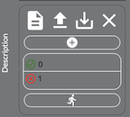
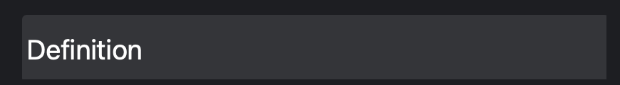
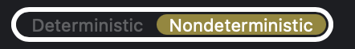
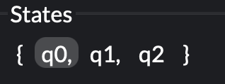
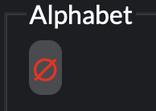
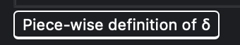
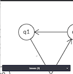

# UI Deep Dive

### Table of Contents

### User Persona
#### Who + Constraints
Undergraduate student enrolled in Computer Science or CSE-adjacent fields. They have lots of large projects, programming assignments, and do not have much time daily. Many also suffer from procrastination or limited work time. They are likely taking an Automata class along with other challenging courses creating a heavy course load. They also may use forms of social media and have been primed for specific UI/UX choices surrounding icons, feedback, flows, etc. If they code, they may be using APIs like VSCode that allow more control over the style; some might prefer Dark Modes. They are accustomized to customization in UI and a streamlined experience. They are used to instant loading, feedback, and gratification. If something isn't obvious, they may leave the site immediately.

#### User Needs
They require obvious iconography; they want to know what features there are at a glance and are unlikely to read lots of text (it must be very pictoral). They want a very clean UI. Many prefer customization (like text sizing, dark mode, etc.). They are likely to use this tool for Automata assignments which would primarilly include creating, editing, and deleting. Therefore, the most obvious features of the UI must be around creating nodes and edges, deleting, clearing, redo-ing and undo-ing. Users may be more likely to screenshot than export their work. A portion of students would use our site over another drawing tool because of the **Testing** feature. Therefore, the testing experience must be efficient, obvious, and easy to use.

---

### Iconography
**Initial Note**: *most icons going forward should have a small text description/title to make it more accessible and obvious. It won't detract from the UI but help to clarify features. We need to prepare not for the ideal user but the one that may click the "new" icon and remove all their work by accident.*

**Importance of Iconography**:
- Good targets: they are typically sized large enough to be easily touched in a finger-operated UI, but also work well with a mouse cursor (in contrast to words, which can suffer from read–tap asymmetry on touch screens)
- Save space: icons can be compact enough to allow toolbars, palettes, and so on to display many icons in a relatively small space
- Fast recognition — particularly true for standard icons that people have seen and used before
- Works internationally no no translation issues
- Visual appeal which enhances the aesthetic appeal of a design.

**Good Iconography**:
- Design is simple and schematic. Use basic characteristics of the object rather than creating a highly realistic image in order to speed up recognition. (Intricate details are difficult to distinguish at smaller sizes.)
- Use the 5-second rule: if it takes you more than 5 seconds to think of an appropriate icon for something, it doesn't communicate its meaning well
- Recognizability: ask people what they expect the icons to stand for
- Memorability: do people remember the icon’s meaning after being told what it represented a couple weeks earlier
- Use as many universal icons are possible: magnifying glass, user profile, link, (eventually Hamburger menu)

- **References**: [Norman Group](https://www.nngroup.com/articles/icon-usability/)

---

### Top Bar Icons

| New | Undo | Redo | Save | Upload | Bug Report |
| --- | ---- | ---- | ---- | ------ | ---------- |
|  |  |  |  |  |  |

#### New & Remove (new addition)
The purpose of this icon is to create a fresh, new page. It basically clears all work. I think that a clearing option can be useful to completely start over. However, there is no delete option on this website which is the most obvious feature users will use. A new page icon (like the one we're using) usually represents creating a new external doc or a new tab. This is currently our only "delete" method meaning users must start completely from scratch. Once this button has been clicked, it is a blank slate with no undo.

In the webapp, we had a giant trash can at the bottom of the screen. Users could either (a) drag a node towards the trash can, the lines around the screen would go red, and the node would disappear OR (b) they could double-click on the trash can to delete the whole whiteboard. The trash can is an icon everyone is familiar with. In a survey, it was found to be one of the *least ambiguous* icons. However, it was incorrectly labeled 'Delete' when it was actually a 'Remove' because, upon clicking the 'Undo' option, the node(s) reappeared in their previous position. Deletes are final (a destruction of data); removals are temporary (old data still accessible). While deletes are commonly associated with a trash can rather than removals, the visible trash can is so intuitive and obvious that users would be more likely to engage the feature. 

I think we can have both a clear and remove option. This can take the form of the following:
- (a) clear and remove are both icons at the top; both are trash cans with one having an 'x' for a more permanent deletion (aka clear)
- (b) users can back/right click on the whiteboard and choose clear
- (c) users can back/right click on a node and choose remove
- NOTE: we may want to have a notification of "Are you sure you want to clear" to confirm they understand that a clear removes ALL work
  - we can also log whether they're a new user or not so we only give them this warning the first time they use the site so it doesn't get annoying

- **References**: [Remove vs Delete](https://medium.com/swlh/ui-copy-remove-vs-delete-33c58ce16d9b) and [Trash can unambiguous](https://medium.com/@annakop/lean-ux-icon-testing-7f7fb78412e)

---

#### Undo & Redo
Intuitive and follows the design of Google's undo/redo arrows. Follows a natural mapping of undo as left/the past and redo as right/future. The only change may be to make the undo arrow slightly darker than the redo to make it a bit more distinct and match the Google style.

- **References**: [Legacy of Undo/Redo](https://ux.stackexchange.com/questions/83723/why-are-the-undo-and-redo-arrow-icons-commonly-round)

---

#### Save & Upload
These are a little tricky. 'Save' is actually a **download** because it's moving from the remote server to a local drive. However, once the user clicks the upper tool bar 'Save' icon, the side bar pulls out and is labelled as 'Export'. Now, export is actually when we move from a local application to a remote drive. This is an issue because traditional download and export icons are VERY different: a download has a flat bar with an arrow pointing down; an export is when we have an arrow pointing out of a box. The directions of the arrows follow our learned mapping of downloading locally or exporting externally. Our 'save' icon has a box with an arrow pointing down. This is the icon for 'Import'. We need to be using a bar and arrow icon.

The 'Upload' is correct in that it's moving from a local drive to a remote server. The icon is correctly used (bar with arrow pointint up).

- **Suggestion**: Change sidebar wording to be 'Download' not 'Export' for 'save' and use the correct Download icon (bar with arrow).  
- **References**: [Download, Upload, Export, Import](https://graphicdesign.stackexchange.com/questions/119273/import-export-vs-upload-download-icons-arrow-direction)

---

#### Bug Report
The bug logo is explicit and does fit its name. It may be fine to keep it, however, users may also assume it is for "debugging" rather than filing a bug report/feedback. Sometimes feedback icons consist of a thumbs up and thumbs down together as that indicates an approval or disapproval. Many websites also use a circle with a question mark inside to indicate a section where more information/feedback can be given externally. We could also use a circle with an exclamation point as they usually have a negative connotation of "something is wrong" that would align more with the purpose of a bug report.

- **Notes**: after doing a bit more research, I [found our icon](https://material.io/resources/icons/?style=baseline) and it is in fact labeled a 'bug report' so we may not change it.

---

### Side Bar Icons

| Expand | Format | Test | Transform | Export |
| ------ | ------ | ---- | --------- | ------ | 
|  |  |  |  |  |

#### Expand
The expand icon lets the user pull out the sidebar. This is actually a version of the disclosure triangle which is popular for expanding sections. These sections tend to be vertically displayed: the triangle tip points right when condensed and down when the section below is expanded. It isn't used for side bars as much (horizontal display). For side bars, the current winner, and favorite among 20-somethings is the hamburger side bar icon (3 lines). However, there has been much criticism over the hamburger side bar as there is less discoverability because the user has no idea what the menu features. UI experts are pushing for more explicit side bar features like our side bar icons for 'Format'/'Test'/etc. Since we already have those icons for the sub-sections of the sidebar, the disclosure triangle is redundant and not necessary. 

- **Suggestion**: remove this icon
- **References**: [Hamburger menu icon](https://smallbiztrends.com/2015/01/3-line-menu-icon-hamburger-menu.html) and [Explicit sidebar features](https://lmjabreu.com/post/why-and-how-to-avoid-hamburger-menus/)

---

#### Format
This icon pulls out the side bar for both "Format" and "Definition". Format consists of "Layout" and "Alphabet Label Editor". Currently, the user can only apply the 'Circle' layout and not 'Grid' not the alphabet/renaming features. I think this icon is truly a 'Format' icon as the majority of the ones on the web are a page (usually with a corner folded). It also has horizontal lines in the middle which can relate to text which is what we associate formatting with: justifying text, modifying number of columns, changing margins, etc. Overall, this icon is perfectly usable and intuitive. However, it is weird that the 'Format' feature brings out both the 'Definition' and 'Format' rather than just the 'Format' section. We may also want to include other types of text/stylistic formatting here since that would make the section more obvious. As mentioned in a later section, we may want to have the option to reduce/increase the text size of the node or edge labels. We could easy have those modifications also live in the formatting section.

- **Suggestion**: change the sidebar section for 'Format' to be *just* formatting features.

---

#### Test
This running man icon is supposed to indicate testing. However, it's not intuitive other than the fact that we have to *"run"* a test. It makes it very hard for users to discover the testing section which is, arguably, the most important section. This is not a good signifier and, likely, users wouldn't even click on it until they had given up other options and would be surprised that this was, in fact, testing. Many tests icons either use a gear or a shape with a check mark. The check mark typically indicates a check/evaluation to determine good functionality. Similarly, the individual tests should either have an icon (like in the old version) of a green check or red 'x' to indicate success or failure or the test boxes should be outlined in those colors. There is almost no feedback. However, it is good that the trash can icon is used to 'delete' the test. (For future reference, we might use the 'clear' trash can as the test deletion is final).

- **Suggestion**: change icon to gear with check mark and add icons/color changes to tests

---

#### Transform
The purpose of this option is to convert DFA :left_right_arrow: NFA, flip accept :left_right_arrow: nonaccept states, or delete unreachable states. All of these are more 'conversions' or 'swaps' than transformations. I think we should use 2 circular arrows to indicate we are alternating between states to be more indicative. In a survey, it was shown that most people found the icon ambiguous and the majority labeled it as modify/edit/create. However, the program is doing all the transforming so another icon is better suited.

- **References**: [Pencil Icon](https://ux.stackexchange.com/questions/117143/pencil-icon-for-create-vs-edit-is-there-a-correct-answer) and [Pencil Icon is Ambiguous](https://medium.com/@annakop/lean-ux-icon-testing-7f7fb78412e)

---

#### Export
This has the same icon as the 'Save' in the top/app bar. Both of these options pull out the sidebar and give options on how to download the work as different file types. This is NOT an export as we are not sharing but downloading the file locally. It is redundant to have 2 icons doing the same thing but labelled differently. This icon obviously goes against the traditional 'Export' icon (arrow pointing up, outside of box) as our arrow points inward. We need to remove one of these icons and make it represent the download one.

- **Suggestion**: Choose whether icon should live in top bar or side bar and use the correct Download icon (bar with arrow).  
- **References**: [Download, Upload, Export, Import](https://graphicdesign.stackexchange.com/questions/119273/import-export-vs-upload-download-icons-arrow-direction)

---

### Feedback
| Definition Label | Determinism Button | States Content | Alphabet Content | Definition Button |
| ---------------- | ------------------ | -------------- | ---------------- | ----------------- |
|  |  |  |  |  |

#### Definition Label
The user can click this label to expand or contract the section on definitions. There is good feedback in that, when the user hovers over the label, it turns grey (from black) indicating it can be clicked. There is also instant feedback with the section being hid or revealed upon a button press. Without the changing color, users wouldn't know it was a button rather than just text. For exand/contract sections, they are usually paired with a disclosure triangle to signify that the section can be condensed. Note: I don't know if we really need to expand/contract so we should determine that need.

- **Suggestion**: add disclosure triangle to make it even more obvious

---

#### Determinism Button
This button isn't in a tradition style. Most buttons are a solid color with text over it; when a mouse hovers, they change color slightly (darker/lighter) to indicate clickability; when a mouse clicks, they change color or depress to indicate that the action was successfully taken (bridging the Gap of Evaluation). However, this button has no change on a hover nor does it look like a traditional button so there may not be enough discoverability. This button is a conditional button which has a binary option of A or B which is chosen by clicking one side and making that chosen one stand out (brighter).

- **Suggestion**: redesign this as a more traditional conditional button

---

#### States Content & Alphabet Content
This should just be text, however, when the user hovers over it, it changes the background color to grey (from black) which indicates clickability. This is counter-intuitive in that the user cannot actually change the text. They may try to change the text and find that nothing happens and fall into the blame game; they may even feel dejected and be less likely to use this section in the future.

- **Suggestion**: should not have any change upon a hover (no feedback!)

---

#### Definition Button
This is also text and the

---

### Buttons

- **References**:
  - [How to Design Good Buttons](https://uxdesign.cc/ui-cheat-sheets-buttons-7329ed9d6112)
  - [Types of Buttons](https://semantic-ui.com/elements/button.html) 

---

### Whiteboard
1. When right-clicking on the object, it should pull up the options to: 
- (a) make it an accept state (if not)
- (b) make it a non-accept state (if not)
- (c) delete that node
- (d) make it the initial state.
2. When clicking/hovering or doing any engagement with a node, it should change color slightly (lighter/darker) to indicate which node the user is interacting with and help them confirm their behavior
3. Arrows auto-conform to fit the distance/angle which is great
4. Nodes and arrows could be more distinct
5. For a large alphabet, the arrow gets filled with a lot of text that can fill up the space
  - text resizing should be an option (like a bar with +/- to change arrow text)
  - node text isn't a problem because it's typically only 2 characters (e.g. q2)

### Issues
1. It's not clear how to add labels to the edges.
2. It's not clear how to change which is the start state (right-click and drag the triangle)
3. It's not clear whether the tests ran well.
4. The issues bar, when collapsed, has a weird expansion thing that will shift it down.
- 
